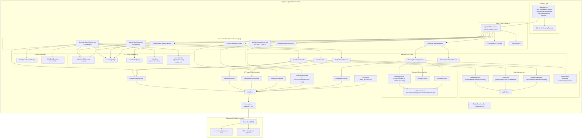

```mermaid
flowchart TB
  %% C4-like layered view of the Angular architecture

  subgraph Client["Angular App (enterprise-demo)"]
    direction TB

    subgraph Routing["Routing Layer"]
      AR["app.routes.ts\n- Lazy load feature routes\n- sessionAuthCanActivate\n- users/project-studio resolvers"]
      SPR["SelectivePreloadingStrategy"]
    end

    subgraph Shell["Shell / Cross-cutting UI"]
      SH["AppShellComponent\n(nav, language, theme)"]
      I18N["I18nService + I18nPipe"]
      THEME["ThemeService"]
    end

    subgraph Features["Feature Modules (Standalone Pages)"]
      DASH["DashboardPageComponent\n(+ presenters)"]
      USERS["UsersPageComponent\n(+ presenters)"]
      PSTUDIO["ProjectStudioPageComponent"]
      PROJECTS["Projects list/details pages"]
      ANALYTICS["AnalyticsPageComponent\n(AG Grid + Chart.js)"]
      REALTIME["RealtimePageComponent"]
      PLANNING["PlanningPageComponent"]
    end

    subgraph UIlib["UI Library (projects/ui)"]
      UIBTN["ui-button (CVA-ready usage)"]
      UIINPUT["ui-input (CVA)"]
      UITEXT["ui-textarea (CVA)"]
      UISURF["ui-surface\n(ng-content slots)"]
      UITPL["ui-template-list\n(ng-template + ng-container)"]
    end

    subgraph Directives["Shared Directives"]
      TOOLTIP["TooltipDirective (attribute)"]
      IFDATA["IfHasDataDirective (structural)"]
    end

    subgraph Facades["Facade / VM Layer"]
      DF["DashboardFacade"]
      UF["UsersFacade"]
      PF["ProjectStudioFacade"]
      PLF["PlanningFacade (signals)"]
      PVM["PlanningViewModelService"]
    end

    subgraph State["State Management"]
      STORE["NgRx Store"]
      DSlice["dashboard slice\n(actions/effects/reducer/selectors)"]
      USlice["users slice\n(actions/effects/reducer/selectors)"]
      PSlice["projectStudio slice\n(actions/effects/reducer/selectors)"]
      SIG["Signals state\n(planning facade/component vm)"]
    end

    subgraph Domain["Domain / Business Core"]
      SF["ScenarioFactory"]
      STF["StrategyFactory"]
      ENG["PlanningEngine\n(Graph + Queue + LinkedList + Tree)"]
      DS["Data structures:\nRecord/Map/Set/Queue/LinkedList/Tree/Graph"]
    end

    subgraph API["API Layer (Core Services)"]
      HTTP["HttpClient"]
      INT["Interceptors:\nrequestId + csrf"]
      DAS["DashboardApiService"]
      USR["UsersApiService"]
      PSS["ProjectStudioApiService"]
      ANS["AnalyticsApiService"]
      RAS["RealtimeApiService\n(+ EventSource/WebSocket usage)"]
      PLS["PlanningApiService"]
      CSRF["CsrfService (APP_INITIALIZER)"]
    end

    ERR["GlobalErrorHandler + LoggerService"]
  end

  subgraph Backend["Express API (api/server.mjs)"]
    direction TB
    CTRLS["Controllers (MVC)"]
    MODEL["In-memory data/service layer"]
    WS["SSE + WebSocket endpoints"]
  end

  %% Routing + shell composition
  AR --> SPR
  AR --> SH
  SH --> DASH
  SH --> USERS
  SH --> PSTUDIO
  SH --> PROJECTS
  SH --> ANALYTICS
  SH --> REALTIME
  SH --> PLANNING

  %% UI library/directives usage
  DASH --> UIBTN
  DASH --> UIINPUT
  DASH --> UISURF
  DASH --> UITPL
  DASH --> TOOLTIP
  DASH --> IFDATA

  USERS --> UIBTN
  USERS --> UIINPUT
  PSTUDIO --> UIBTN
  PSTUDIO --> UIINPUT
  PSTUDIO --> UITEXT
  SH --> I18N
  SH --> THEME

  %% Feature -> facade/state flows
  DASH --> DF
  USERS --> UF
  PSTUDIO --> PF
  PLANNING --> PLF
  PLANNING --> PVM

  DF --> DSlice
  UF --> USlice
  PF --> PSlice
  DSlice --> STORE
  USlice --> STORE
  PSlice --> STORE
  PLF --> SIG

  %% Planning domain pipeline
  PLF --> SF
  PLF --> STF
  PLF --> ENG
  ENG --> DS
  SF --> DS

  %% API interactions
  DF --> DAS
  DF --> DAS
  UF --> USR
  PF --> PSS
  ANALYTICS --> ANS
  REALTIME --> RAS
  PLF --> PLS
  PROJECTS --> PSS
  DASH --> DAS

  DAS --> HTTP
  USR --> HTTP
  PSS --> HTTP
  ANS --> HTTP
  RAS --> HTTP
  PLS --> HTTP
  CSRF --> HTTP
  HTTP --> INT
  INT --> Backend

  %% Backend internals
  Backend --> CTRLS
  CTRLS --> MODEL
  CTRLS --> WS

  %% Cross-cutting
  Client --> ERR
```
